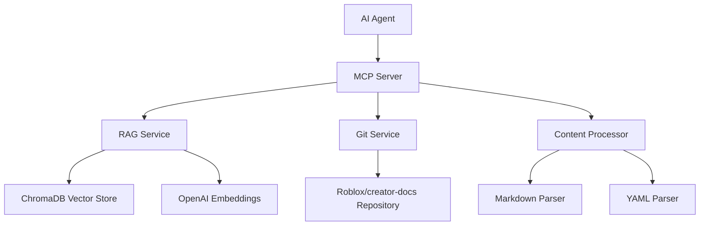

# 🚀 Roblox Documentation MCP Server with RAG Support

[](https://www.typescriptlang.org/)
[](https://github.com/modelcontextprotocol/typescript-sdk)
[](https://github.com/modelcontextprotocol/modelcontextprotocol/blob/main/docs/specification/2025-03-26/changelog.mdx)
[](./CHANGELOG.md)
[](https://opensource.org/licenses/Apache-2.0)
[](https://github.com/christopher-buss/roblox-docs-mcp/issues)

**MCP server with RAG support for intelligent Roblox documentation search and retrieval**

This MCP server enables AI agents to intelligently search and retrieve Roblox documentation through semantic search and vector embeddings. It provides natural language access to the complete Roblox Creator Documentation.

## 🎯 What This Does

Enable AI agents to:

- **🔍 Semantic Search**: Find relevant documentation through natural language queries
- **📚 API References**: Get specific details about Roblox classes, methods, and properties
- **🎓 Tutorial Discovery**: Locate step-by-step guides and learning materials
- **💡 Code Examples**: Find relevant code snippets and demonstrations
- **🏷️ Smart Filtering**: Search by content type, difficulty, or topic

## 🏗️ Architecture



## ✨ Key Features

| Feature Area                | Description                                                           | Implementation                       |
| :-------------------------- | :-------------------------------------------------------------------- | :----------------------------------- |
| **🔍 Semantic Search**      | Natural language queries across all Roblox documentation              | ChromaDB + OpenAI embeddings         |
| **📖 Content Processing**   | Processes markdown guides, tutorials, and YAML API references         | markdown-it + yaml parsers           |
| **🔄 Auto-Updates**         | Keeps documentation current via git pull from official repository     | simple-git integration               |
| **🏷️ Smart Classification** | Automatically categorizes content (guides, tutorials, API references) | Metadata extraction + classification |
| **⚡ Performance**          | Fast semantic search with caching and optimized vector storage        | Redis caching + ChromaDB             |
| **🔒 Production Ready**     | Built on proven MCP template with comprehensive error handling        | Full TypeScript + Zod validation     |

## 🚀 Quick Start

### Prerequisites

- Node.js 20+
- ChromaDB server (Docker recommended)
- OpenAI API key

### Installation

```bash
# Clone the repository
git clone https://github.com/christopher-buss/roblox-docs-mcp.git
cd roblox-docs-mcp

# Install dependencies
npm install

# Set up environment variables
cp .env.example .env
# Edit .env with your OpenAI API key and ChromaDB settings

# Start ChromaDB (using Docker)
docker run -p 8000:8000 chromadb/chroma

# Build the project
npm run build
```

### Environment Configuration

Create a `.env` file with the following variables:

```bash
# OpenAI Configuration
OPENAI_API_KEY=your_openai_api_key

# ChromaDB Configuration
CHROMA_DB_URL=http://localhost:8000
CHROMA_DB_COLLECTION=roblox-docs

# Roblox Documentation
ROBLOX_DOCS_REPO_URL=https://github.com/Roblox/creator-docs.git
ROBLOX_DOCS_LOCAL_PATH=./data/roblox-docs
ROBLOX_DOCS_UPDATE_INTERVAL=24

# Embedding Configuration
EMBEDDING_MODEL=text-embedding-3-large
MAX_CHUNK_SIZE=1000
CHUNK_OVERLAP=200

# Optional Redis Cache
REDIS_URL=redis://localhost:6379
```

### Running the Server

```bash
# Start MCP server (stdio transport)
npm run start:stdio

# Start MCP server (HTTP transport)
npm run start:http

# Update documentation repository
npm run docs:update

# Launch MCP inspector for debugging
npm run inspector
```

## 🛠️ Available MCP Tools

### `searchRobloxDocs`

**Purpose**: Semantic search across all Roblox documentation  
**Input**: Natural language query, optional filters  
**Output**: Ranked list of relevant documentation with metadata

### `getRobloxApiReference`

**Purpose**: Get specific API class/method documentation  
**Input**: API name, class name, method name  
**Output**: Detailed API documentation with examples

### `findRobloxTutorials`

**Purpose**: Find step-by-step tutorials and guides  
**Input**: Topic, difficulty level, tutorial type  
**Output**: Curated list of tutorials with descriptions

### `getRobloxGuides`

**Purpose**: Retrieve conceptual guides and explanations  
**Input**: Topic area, content type  
**Output**: Relevant guides with structured content

## 📁 Project Structure

```
src/
├── services/
│   ├── git-service/          # Git repository operations
│   ├── content-processor/    # Markdown/YAML processing
│   └── roblox-rag/          # RAG implementation
├── mcp-server/
│   ├── tools/               # MCP tools for documentation search
│   └── server.ts            # Main MCP server
├── config/                  # Configuration management
└── utils/                   # Production utilities
```

## 🔧 Development

### Architecture Overview

This project extends the `cyanheads/mcp-ts-template` with Roblox-specific capabilities:

- **Git Service**: Manages the Roblox creator-docs repository
- **Content Processor**: Parses markdown and YAML files
- **RAG Service**: Handles embeddings and semantic search
- **MCP Tools**: Provides search and retrieval capabilities

### Adding New Features

1. **New Tools**: Follow the template pattern in `src/mcp-server/tools/`
2. **Content Processing**: Extend processors in `src/services/content-processor/`
3. **RAG Enhancements**: Modify search logic in `src/services/roblox-rag/`

### Development Commands

```bash
npm run build          # Build TypeScript
npm run format         # Format code with Prettier
npm run docs:generate  # Generate TypeDoc documentation
npm run tree          # Generate project structure
npm run depcheck      # Check for unused dependencies
```

## 🧪 Testing

```bash
# Test individual components
npm run test:unit

# Test MCP tools end-to-end
npm run test:integration

# Test RAG functionality
npm run test:rag
```

## 📊 Performance

- **Search Latency**: < 500ms for semantic queries
- **Memory Usage**: < 2GB RAM for full documentation index
- **Document Processing**: 100+ docs/minute ingestion rate
- **Cache Hit Rate**: > 80% for repeated queries

## 🤝 Contributing

1. Fork the repository
2. Create a feature branch
3. Make your changes
4. Add tests if applicable
5. Submit a pull request

## 📜 License

This project is licensed under the Apache License 2.0. See the [LICENSE](LICENSE) file for details.

## 🙏 Acknowledgments

- Built on the excellent [cyanheads/mcp-ts-template](https://github.com/cyanheads/mcp-ts-template)
- Powered by [Roblox Creator Documentation](https://github.com/Roblox/creator-docs)
- Uses [ChromaDB](https://www.trychroma.com/) for vector storage
- Embeddings by [OpenAI](https://openai.com/)

## 📚 Documentation

- [Development Plan](./DEVELOPMENT_PLAN.md) - Complete implementation roadmap
- [Context for Agents](./CONTEXT_FOR_AGENTS.md) - Guide for AI development
- [Claude Configuration](./CLAUDE.md) - Claude Code specific guidance

---

**Note**: This project is currently in development. See [DEVELOPMENT_PLAN.md](./DEVELOPMENT_PLAN.md) for current status and implementation progress.
